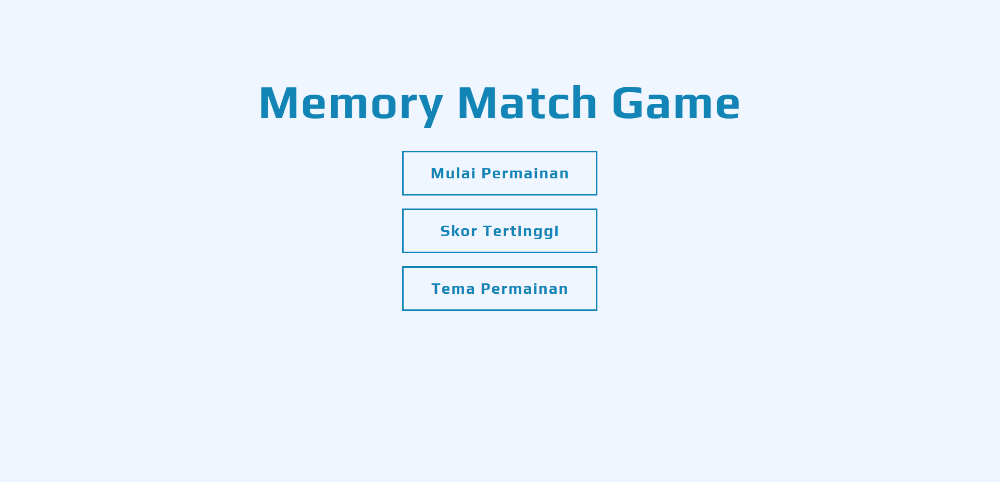
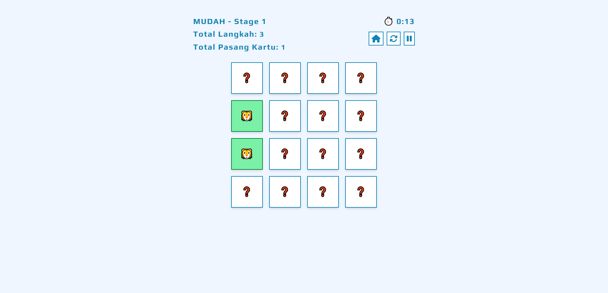
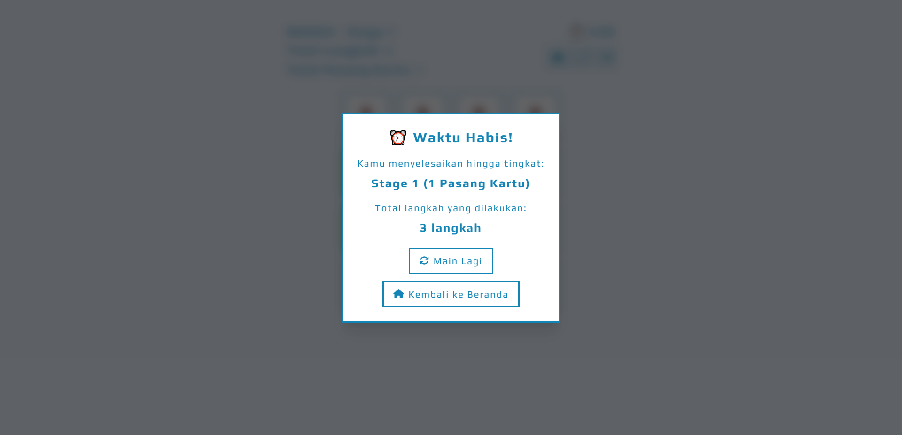
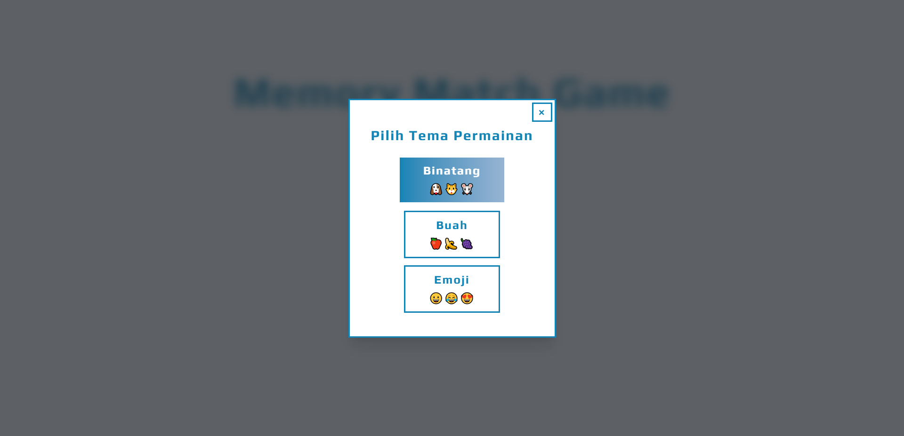

# 🧠 MemoryMatch – Latih Daya Ingatmu dengan Game Memory Card!

MemoryMatch adalah game web interaktif berbasis React.js yang dirancang untuk melatih dan meningkatkan kemampuan daya ingat seseorang melalui permainan pencocokan kartu yang menyenangkan dan edukatif.



---

## 🎯 Tujuan

Membantu pengguna dari berbagai usia dalam:

- Meningkatkan fokus dan konsentrasi
- Melatih daya ingat jangka pendek
- Mengurangi kejenuhan dengan permainan yang sederhana namun menantang

---

## 🧰 Teknologi yang Digunakan

- ⚛️ React.js (functional components + hooks)
- 🎨 Tailwind CSS (utility-first styling)
- 📦 IBM Granite (code generation & completion)
- 🔧 Lighthouse (performance testing)

---

## 🚀 Fitur Utama

- ✅ **3 Pilihan Tingkat Kesulitan:** Mudah, Sedang, Sulit
- 🔁 **Stage Bertingkat:** (Mudah-1, Mudah-2, dst.) dengan pengacakan kartu ulang tiap naik stage
- ⏱️ **Timer Global:** Permainan berlangsung hingga waktu habis (default 3 menit)
- ⭐ **Skor Tertinggi**: Mencatat skor tertnggi yang telah dicapai.
- 🧩 **Desain Responsif:** Menggunakan Tailwind CSS, tampil optimal di desktop & mobile
- 🎉 **Popup Game Over:** Modal tampil saat waktu habis disertai info level terakhir
- ♻️ **Restart Mudah:** Reset permainan dengan sekali klik
- 🎨 **Variasi Tema:** Tampilan tema yang variatif (Binatang, Buah, Emoji)

---

## 🖼️ Demo

Akses secara langsung disini [https://meinhere-memory-match.vercel.app/](https://meinhere-memory-match.vercel.app/)





---

## 📂 Struktur Proyek

```
src/
├── components/
│   ├── Board.jsx
│   ├── ButtonGameMenu.jsx
│   ├── ButtonHome.jsx
│   ├── ButtonHomePlay.jsx
│   ├── ButtonHomeTheme.jsx
│   ├── Card.jsx
│   ├── ModalGameOver.jsx
│   ├── ModalHome.jsx
│   ├── Timer.jsx
├── utils/
│   └── config.js
│   └── shuffle.js
│   └── themes.js
├── App.jsx
├── index.css
└── main.js
```

---

## 📦 Instalasi & Menjalankan Secara Lokal

1. **Clone Repository**

```bash
git clone https://github.com/meinhere/memory-match.git
cd memory-match
```

2. **Install Dependencies**

```bash
npm install
```

3. **Jalankan di Localhost**

```bash
npm run dev
```

Setelah server berjalan, buka [http://localhost:5173](http://localhost:5173) di browser untuk mulai bermain.

---

## 🤖 Peran AI dalam Pengembangan

Penggunaan teknologi AI dalam proses pengembangan, diantaranya:

- **Brainstroming Rancangan Projek:** Membuat rancangan projek dari awal, proses pengembangan, optimasi.
- **Generate UI:** Menghasilkan desain antarmuka gameplay yang minimalis dan nyaman untuk dilihat oleh pengguna.
- **Optimasi Gameplay:** Melakukan refactoring code untuk meningkatkan performa dari website sehingga dapat berjalan dengan optimal.
- **Pembuatan Dokumentasi:** Generate dokumentasi kode dan fitur secara otomatis dengan cepat dan relevan.
- **Generate Slide:** Generate slide ppt untuk menampilkan proses pembuatan dan pengembangan projek.

## ✨ Pengembangan Selanjutnya

- 📝 Efek animasi flip kartu (CSS transform 3D)
- 📝 Efek suara selama permainan (audio)
- 📝 Dapat mengatur timer waktu permainan
- 📝 Refactoring code (membuat variabel config yang dinamis)

---

## 📜 Lisensi

MIT License © 2025 Sabil Ahmad
