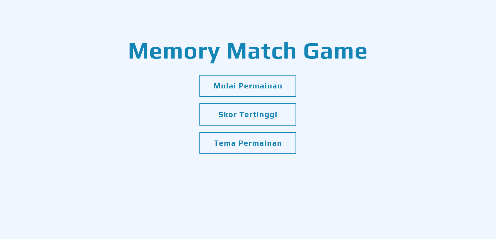

# 🧠 MemoryMatch – Latih Daya Ingatmu dengan Game Memory Card!

MemoryMatch adalah game web interaktif berbasis React.js yang dirancang untuk melatih dan meningkatkan kemampuan daya ingat seseorang melalui permainan pencocokan kartu yang menyenangkan dan edukatif.

 <!-- Ganti dengan screenshot asli -->

---

## 🎯 Tujuan

Membantu pengguna dari berbagai usia dalam:

- Meningkatkan fokus dan konsentrasi
- Melatih daya ingat jangka pendek
- Mengurangi kejenuhan dengan permainan yang sederhana namun menantang

---

## 🚀 Fitur Utama

- ✅ **3 Pilihan Tingkat Kesulitan:** Mudah, Sedang, Sulit
- 🔁 **Tingkatan Bertahap:** (Mudah-1, Mudah-2, dst.) dengan pengacakan kartu ulang tiap naik tingkat
- ⏱️ **Timer Global:** Permainan berlangsung hingga waktu habis (default 3 menit)
- 🧩 **Desain Responsif:** Menggunakan Tailwind CSS, tampil optimal di desktop & mobile
- 🎉 **Popup Game Over:** Modal tampil saat waktu habis disertai info level terakhir
- ♻️ **Restart Mudah:** Reset permainan dengan sekali klik

---

## 🖼️ Demo

🚧 Coming soon on [Netlify/Vercel]

<!-- 📸 _Tambahkan screenshot game di sini_ -->

---

## 🧰 Teknologi yang Digunakan

- ⚛️ React.js (functional components + hooks)
- 🎨 Tailwind CSS (utility-first styling)
- 📦 Modular Component Architecture
- 🧠 Custom Game Logic (shuffle, timer, stage control)

---

## 📂 Struktur Proyek

```
src/
├── components/
│   ├── Board.jsx
│   ├── ButtonGameMenu.jsx
│   ├── ButtonHome.jsx
│   ├── ButtonHomePlay.jsx
│   ├── ButtonHomeTheme.jsx
│   ├── Card.jsx
│   ├── ModalGameOver.jsx
│   ├── ModalHome.jsx
│   ├── Timer.jsx
├── utils/
│   └── shuffle.js
│   └── themes.js
├── App.jsx
├── index.css
└── main.js
```

---

## 📦 Instalasi & Menjalankan Secara Lokal

1. **Clone Repository**

```bash
git clone https://github.com/meinhere/memory-match.git
cd memory-match
```

2. **Install Dependencies**

```bash
npm install
```

3. **Jalankan di Localhost**

```bash
npm run dev
```

Setelah server berjalan, buka [http://localhost:5173](http://localhost:5173) di browser untuk mulai bermain.

---

## ✨ Pengembangan Selanjutnya

- 📝 Efek animasi flip kartu (CSS transform 3D)
- 📝 Efek suara selama permainan (audio)
- 📝 Dapat mengatur timer waktu permainan
- 📝 Refactoring code (membuat variabel config yang dinamis)

---

## 📜 Lisensi

MIT License © 2025 Sabil Ahmad
